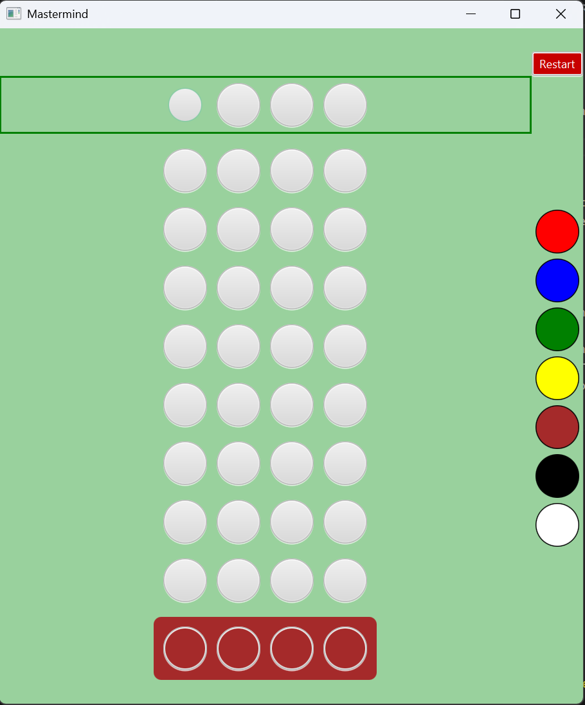

# Mastermind Project
## Overview
A small fun summer project to build the board game Mastermind.
This project demonstrated my programming approach, including documentation, encapsulation, OOP and Model-View separation.

## Launching the application
You will need at least Java 17 and Maven is required. If you build an uber JAR then you will only need Java and can
then double click on the JAR. Otherwise, ensure that the `mvn` command is on the path and run `mvn javafx:run` in the top-level folder.

## Rules
Your goal is to guess what random combination of coloured pins is hidden on the bottom row (duplicates are allowed). You have a (configurable) number of guesses to deduce this based on the feedback after each guess.

A CORRECT_COLOUR_CORRECT_POSITION_RESULT_COLOUR (default is black) indicates that there is a pin in the correct position that is also the correct colour. A CORRECT_COLOUR_WRONG_POSITION_RESULT_COLOUR (default is white) indicates that there is a pin of the correct colour in the wrong position. The order and position of the feedback pins is irrelevant. 

If there are 4 CORRECT_COLOUR_CORRECT_POSITION_RESULT_COLOUR then the guess matches what is hidden and you have won. However, if you make the last guess and it is wrong then you have sadly lost.
